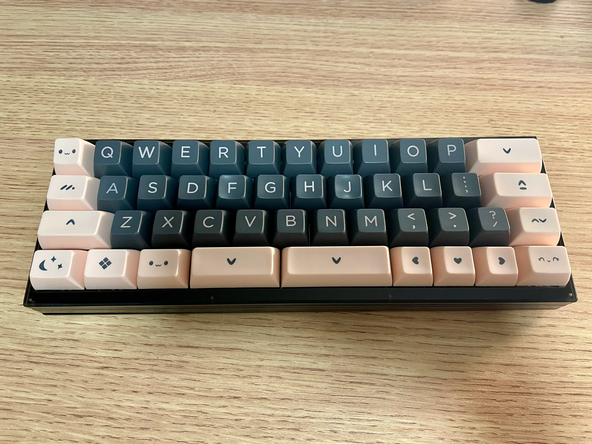
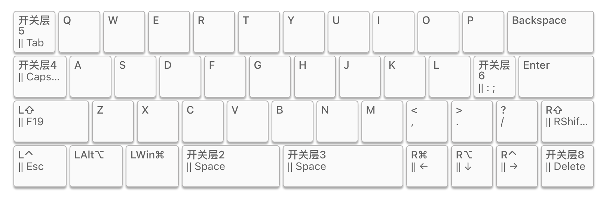
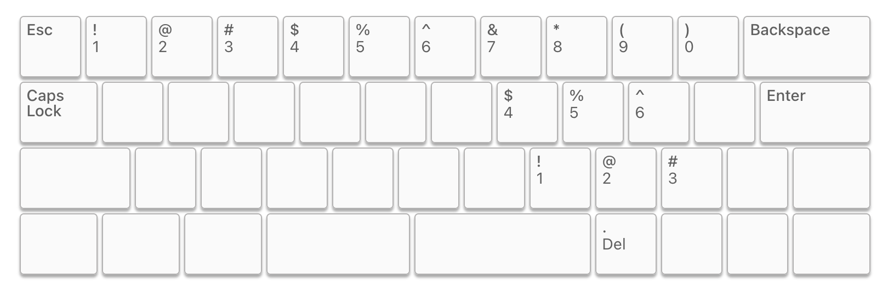
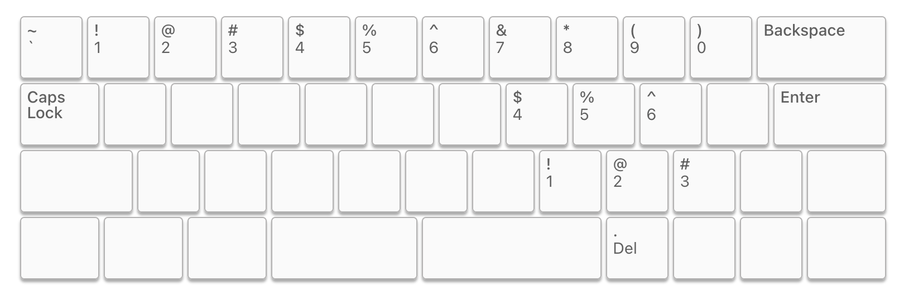
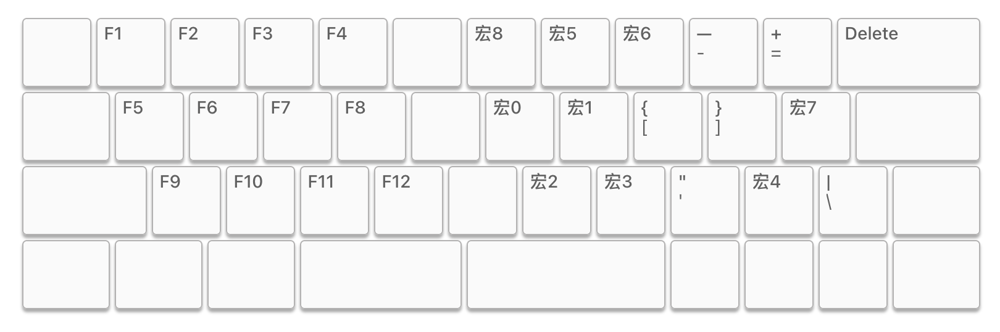
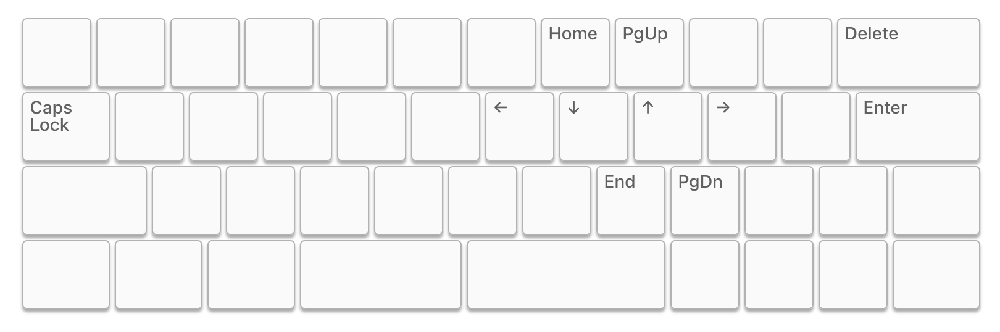
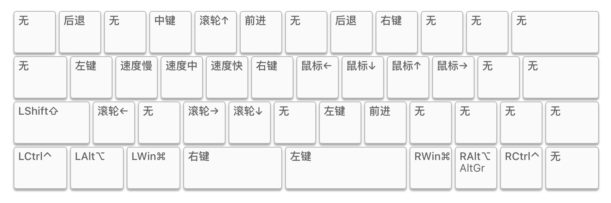
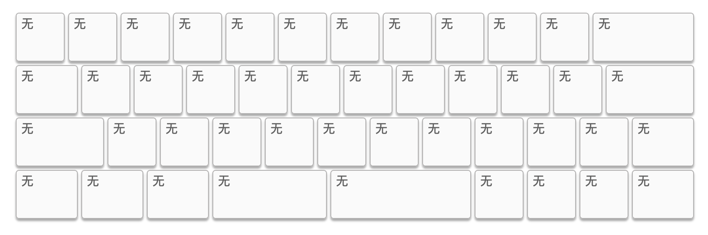
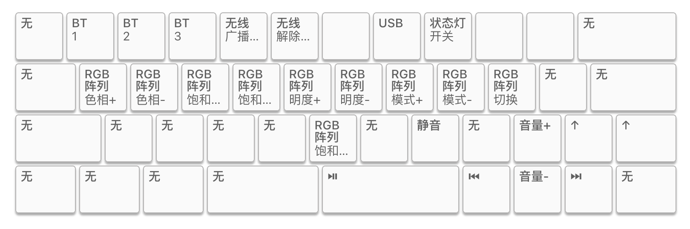

# Omega 45

## 键盘外观

- 键帽：SA Bliss
- 轴：TTC 爱心轴

## 层信息

第一层

第二层

第三层

第四层

第五层

第六层

第七层

第八层

## 相关链接

- [帮助文档](https://wiki.glab.online/summary/)
- [Lotlab 键盘配置工具](https://keyboard.lotlab.org/)
